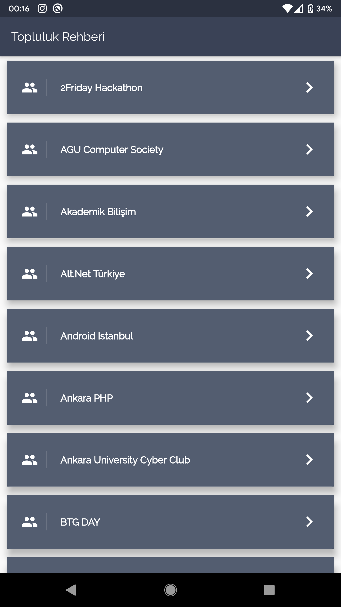
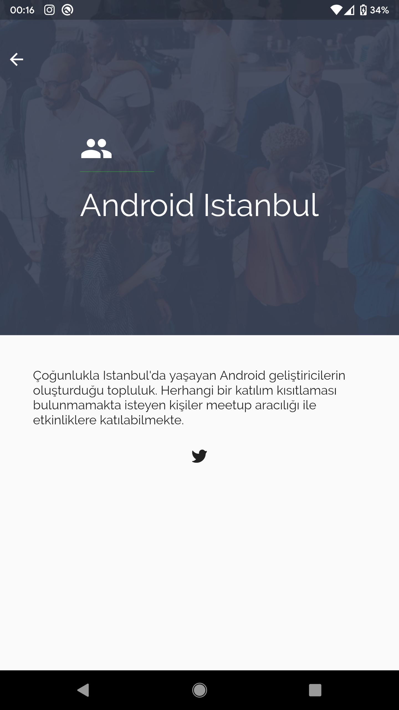

<h1 align="center">Topluluk Rehberi - Flutter Mobil Uygulama</h1>

Açık kaynak topluluk rehberi verisi ile oluşturmuş, açık kaynak flutter mobil uygulama.

## Ekran Görüntüsü

  

## Contributing

Uygulamada değiştirmek istediğiniz bir kısım varsa forklayıp, PR göndererek yardımcı olabilirsiniz.

## Uygulama Arayüzü

Renkler ve Font - [Pinterest](https://tr.pinterest.com/pin/296041375495451936/)